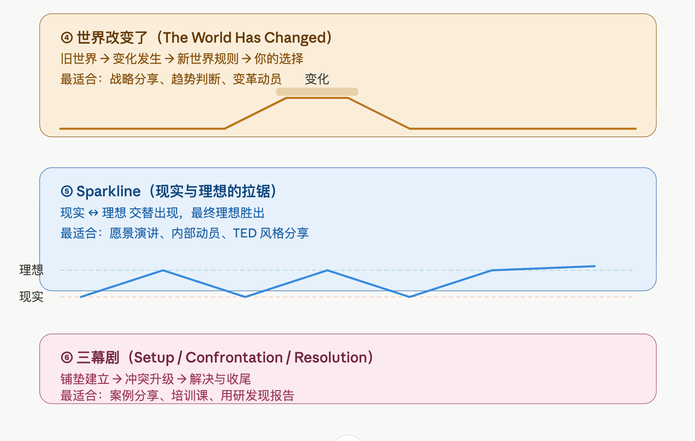

# PPTX Deck Builder

> Make AI execute presentation rules instead of freestyling, then generate polished `.pptx` decks with PptxGenJS.

---

## What this is

`pptx-deck-builder` is a presentation-generation skill for turning a talk title, outline, and speaking notes into a polished slide deck.

It is built around a simple idea: **AI should execute a presentation system, not improvise one.**

Instead of asking a model to "make a PPT" and then cleaning up stretched images, chaotic fonts, and random colors, this skill forces a more reliable workflow:

1. **Clarify the audience, thesis, duration, and structure first**
2. **Choose a narrative pattern before writing slides**
3. **Generate the deck with fixed layout, typography, image, and color rules**

This repo contains the extracted source files from the skill package, so you can inspect, reuse, and version the prompts directly.

---

## Preview

### 1) Storytelling frameworks

The skill helps structure a presentation before slide production begins.




### 2) Theme system

The visual layer uses swappable presentation themes instead of one-off styling decisions.

#### Theme example: Dark Night × Orange Glow


#### Theme example: Deep Sea Blue


#### Theme example: Forest Green × Warm Sand


#### Theme example: Deep Purple × Gold


---

## Included files

```text
.
├── README.md
├── SKILL.md
├── assets/
│   ├── storytelling-frameworks-1.png
│   ├── storytelling-frameworks-2.png
│   ├── theme-dark-night-orange-glow.png
│   ├── theme-deep-sea-blue.png
│   ├── theme-forest-green-warm-sand.png
│   └── theme-deep-purple-gold.png
└── references/
    ├── content-strategy.md
    ├── core-patterns.md
    └── color-palettes.md
```

- **SKILL.md**: the main workflow, intake checklist, and deck-building process
- **references/content-strategy.md**: how to turn raw speaking ideas into a slide-by-slide presentation
- **references/core-patterns.md**: PptxGenJS templates, layout patterns, image handling, and implementation rules
- **references/color-palettes.md**: multiple swappable palette systems for different presentation moods

---

## Core workflow

### 1) Intake first
Before making slides, collect:

- target audience
- talk duration
- title or thesis
- outline / section structure
- speaking notes / examples
- screenshots or images
- palette preference

### 2) Design the story before the slides
Propose a slide-by-slide outline first. Restructuring at the outline stage is much cheaper than fixing a full deck later.

### 3) Generate the deck with rules
Use PptxGenJS patterns from `references/core-patterns.md` and the selected palette from `references/color-palettes.md`.

### 4) Visual QA
Render, inspect, and fix layout issues before delivery.

---

## Design principles

- **Microsoft YaHei everywhere**
- **Images must never stretch**
- **Different slide types use different background tones**
- **Do not share mutable option objects across `addText()` calls**
- **Use clean hex values without `#` in PptxGenJS color fields**

---

## Typical requests this skill fits

- "Make a PPT for this topic"
- "Turn this outline into a deck"
- "Build slides from my speaking notes"
- "Regenerate this presentation with a better theme"
- "Create an image-heavy deck without layout breakage"

---

## Usage

If you use skill-based coding agents, place this repo in your skills directory and load `SKILL.md` as the main instruction file.

When higher-fidelity slide behavior is needed, also include the relevant files under `references/`.

---

## License

MIT
